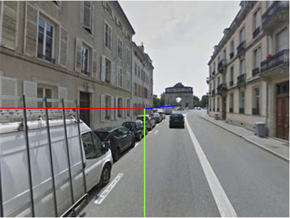

Data:

Training process of ManhattanNet:

1st stage: train Manhattan planes segmentation only

2nt stage: train Manhattan vanishing points regression only

3rd stage: train jointly Manhattan segmentation regression

Results:

More details available in the first section of my thesis (https://tel.archives-ouvertes.fr/tel-01789709/document) ... unfortunatly in French only
